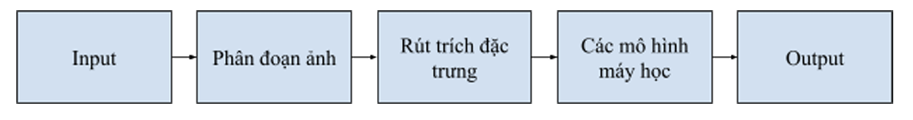
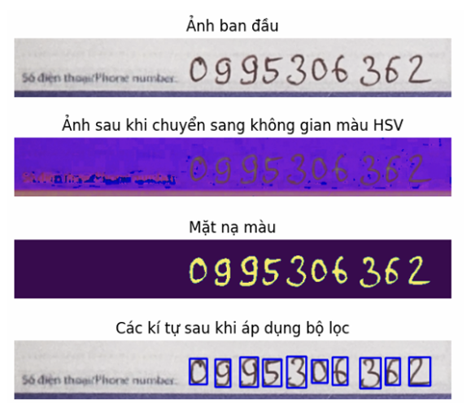
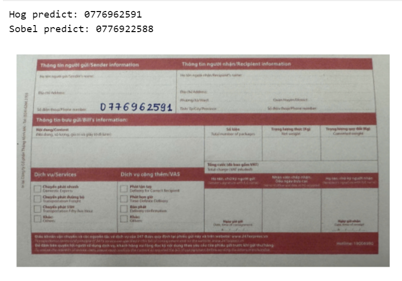

# CS231 Smart OCR for Phone Number Extraction in Logistics

---

## Group Members
- Nguyễn Văn Giáp
- Đào Minh Hải

---

## Introduction
In postal and logistics services, phone numbers of senders and recipients are essential for confirming and delivering shipments. However, manually entering this information from shipping forms is time-consuming and prone to human errors, which negatively affects operational efficiency.

To address this issue, we propose the Phone Number Recognition on Postal Forms task, which aims to automatically extract phone numbers from shipping label images. This automation helps minimize manual entry errors, speed up data processing, and improve the overall workflow of postal operations.

---

## Problem Statement
- **Input:** An image of a postal shipping form containing numeric characters (phone numbers) that are clearly written and not overlapped or obscured by other text.
- **Output:** A string representing the recognized phone number, converted from the content of the image into a usable text format.
- **Constraints:** The phone number in the image must be clearly written and easy to read. The input image should not be blurred, distorted, or heavily affected by background noise. Each image contains only one valid phone number.

---

## Methodology

To tackle the problem of handwritten phone number recognition, our group proposes the following approach, as illustrated in the workflow below:

### Image Segmentation

Image segmentation is an essential step that helps locate the position of the phone number sequence within the image. From the original input image, the segmentation process identifies and isolates each digit in the phone number, enabling more accurate digit recognition in subsequent stages.

### Feature Extraction
- **Histogram of Oriented Gradients (HOG):** Extracts local features based on pixel gradient orientations.
- **Sobel Filter:** Detects edges by calculating image intensity gradients, emphasizing object boundaries.

### Classification Models
- **Support Vector Machine (SVM):** Learns optimal class boundaries in feature space.  
- **k-Nearest Neighbors (KNN):** Classifies images based on similarity to nearby samples.

---

## Experiments

### Dataset
- **Number of images:** 80 (train), 20 (test)
- **Color space:** RGB
- **Number of contributors:** 10 students
- **Samples per person:** 10 images
- **Dataset source:** Collected and created by students from the University of Information Technology (UIT)

### Model Evaluation
We used **5-fold Cross-Validation** to evaluate model performance.

| Feature | Model | Best Parameters | Notes |
|----------|--------|------------------|--------|
| HOG | SVM | C=0.1, kernel='linear' | Best overall |
| HOG | KNN | k=1, metric='mahattan' | Best overall |
| Sobel | SVM | C=10, kernel='rbf' | Best overall |
| Sobel | KNN | k=1, metric='mahattan' | Best overall |

---

## Demo

---

## Contact
For any questions or feedback, please contact the team via email or open an issue on this GitHub repository.

---
